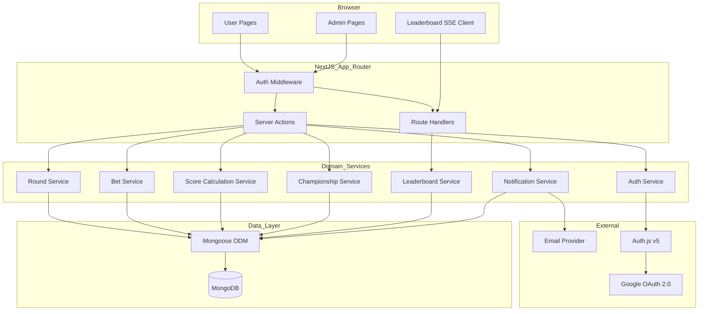
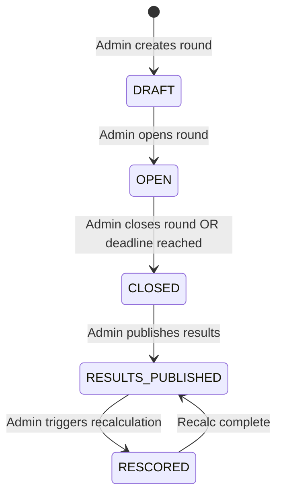
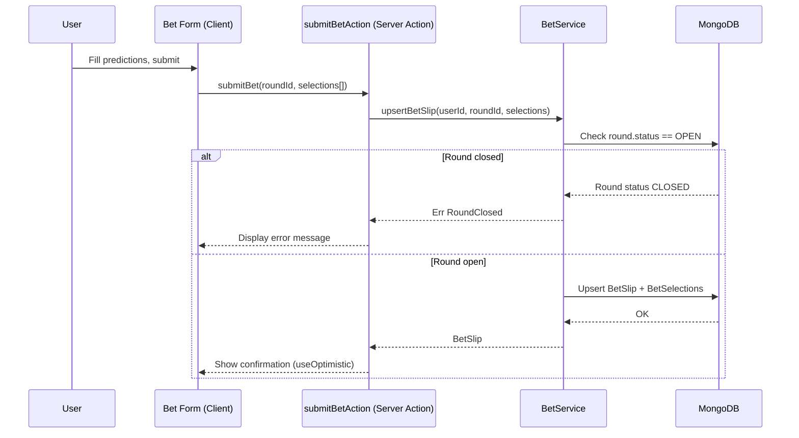
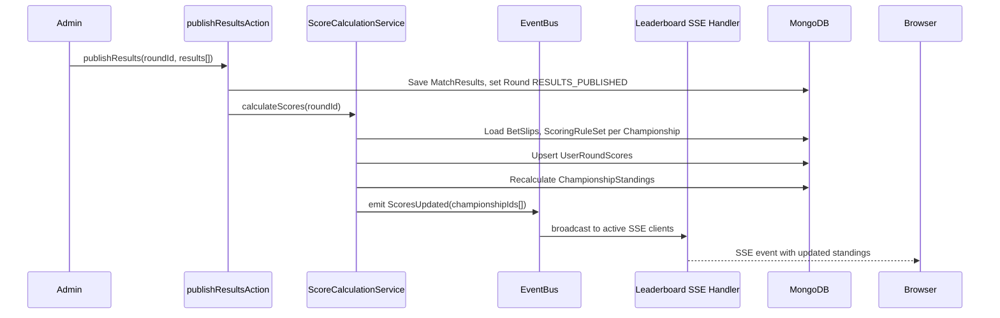
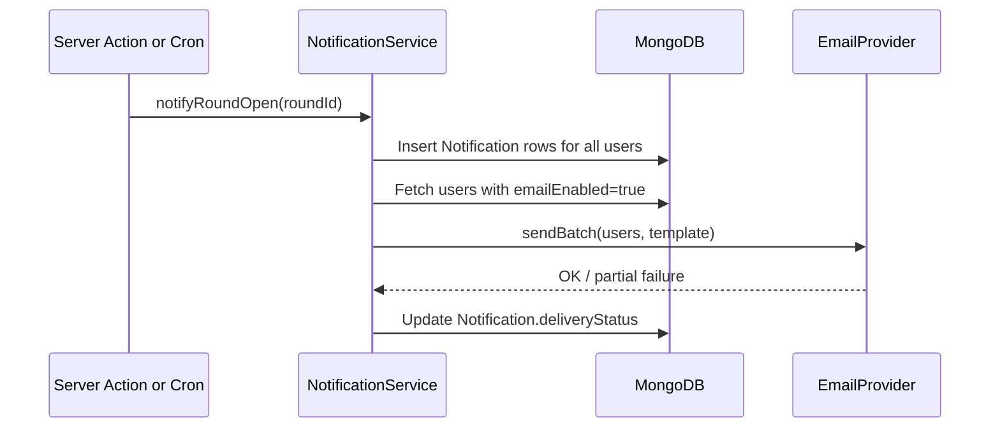
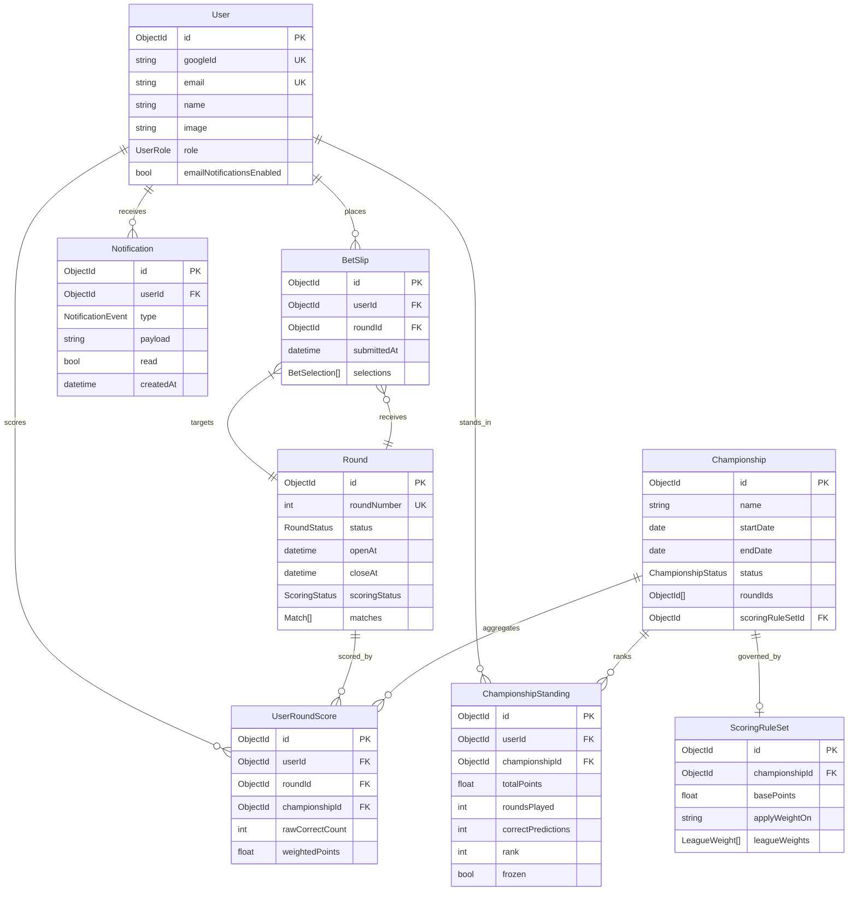

# Technical Design — Loteca Platform

---

## Overview

The **Loteca Platform** is a social prediction-game application built on Brazil's LOTECA lottery. It allows multiple registered users to submit predictions for official LOTECA rounds, earn weighted points based on configurable scoring rules, and compete within administrator-defined championships. Admins manage the full round lifecycle (creation → open → results) and configure championship periods and scoring weights. All historical data (bets, championships, standings) is preserved indefinitely for review.

**Purpose**: This feature delivers a full-stack LOTECA betting platform — from user registration through championship leaderboards — to a community of football fans who want a competitive, point-based LOTECA experience.

**Users**: End users (players) place bets and monitor standings. Platform administrators configure rounds, championships, and scoring rules.

**Impact**: Greenfield — builds the complete platform on an empty Next.js 16 scaffold.

### Goals

- Full round lifecycle: creation, open betting window, result publication, automatic scoring.
- Configurable scoring engine with per-league multipliers and draw-condition rules.
- Multi-championship support with concurrent active periods.
- Near-real-time leaderboard dashboard with historical drill-down.
- Immutable history: closed championships and past bet records are never altered.

### Non-Goals

- Real-money wagering or financial transactions.
- Direct integration with CEF (Caixa Econômica Federal) LOTECA API — results are entered manually by admins.
- Mobile native app (web-responsive only).
- Social features (chat, friend lists) beyond leaderboards.

---

## Requirements Traceability

| Requirement | Summary | Components | Interfaces | Flows |
|-------------|---------|------------|------------|-------|
| 1.1–1.6 | User auth & roles | AuthService, UserRepository | Auth.js session, UserRole enum | Registration, Login flows |
| 2.1–2.6 | Round & match management | RoundService, RoundRepository, MatchRepository | RoundAdminActions, RoundAPI | Round lifecycle state machine |
| 3.1–3.6 | Bet placement & locking | BetService, BetRepository | BetActions, BetStatusView | Bet submission flow |
| 4.1–4.8 | Scoring engine | ScoreCalculationService, ScoringRuleRepository | ScoreActions (admin) | Score calculation flow |
| 5.1–5.6 | Championship config | ChampionshipService, ChampionshipRepository | ChampionshipAdminActions | Championship lifecycle |
| 6.1–6.6 | Leaderboard & dashboard | LeaderboardService, LeaderboardStreamHandler | LeaderboardQuery, SSE stream | Real-time update flow |
| 7.1–7.5 | Bet history review | BetHistoryService | BetHistoryQuery | — |
| 8.1–8.5 | Championship history | ChampionshipHistoryService | ChampionshipHistoryQuery | — |
| 9.1–9.5 | Scoring rule config | ScoringRuleService | ScoringRuleAdminActions | Rule recalculation flow |
| 10.1–10.5 | Notifications | NotificationService, EmailProvider | NotificationActions, EventBus | Notification dispatch flow |

---

## Architecture

### Architecture Pattern & Boundary Map

Feature-module layered architecture co-located with Next.js 16 App Router conventions. Three bounded contexts: **Round & Betting**, **Scoring & Championship**, **Notifications**. Server Actions are the exclusive mutation layer; Route Handlers are reserved for SSE and webhooks.



**Architecture Integration**:
- Selected pattern: Feature-module layered — aligns with Next.js 16 App Router folder structure and Server Actions idioms.
- Domain boundaries: Round & Betting context owns `Round`, `Match`, `BetSlip`, `BetSelection`; Scoring & Championship owns `ScoringRuleSet`, `UserRoundScore`, `Championship`, `ChampionshipStanding`; Notifications owns `Notification`, `NotificationPreference`.
- Server Actions handle all writes; Route Handlers handle SSE streams only.

### Technology Stack

| Layer | Choice / Version | Role | Notes |
|-------|-----------------|------|-------|
| Frontend | Next.js 16, React 19, TypeScript 5 | App Router pages, Server Components, Client Components | Use `useActionState`, `useOptimistic` for bet form UX |
| Styling | Tailwind CSS 3 | Utility-first responsive UI | No CSS-in-JS required |
| Auth | Auth.js v5 (next-auth) | Session management, Google OAuth, role-based guards | Mongoose adapter syncs user records |
| ODM | Mongoose 8 | Typed schema definitions and queries for MongoDB | Uses `mongoose.connect` with connection caching for serverless |
| Database | MongoDB 7 (Atlas) | Document store for all domain data | Atlas free tier viable for MVP; connection string via env var |
| Real-time | SSE Route Handler | Unidirectional leaderboard push | Native `EventSource` client; no external broker |
| Email | Pluggable `EmailProvider` interface | Optional email notifications | Initial implementation: Resend or Nodemailer |
| Background jobs | DB-backed job queue (MVP) | Async notification fan-out, score recalculation | Can upgrade to BullMQ / Inngest post-MVP |

---

## System Flows

### Round Lifecycle & Score Calculation



Key decisions: Transitions are guarded — e.g., only an `OPEN` round accepts bet submissions. `RESULTS_PUBLISHED` triggers the scoring pipeline asynchronously.

### Bet Submission Flow



### Score Calculation Flow



### Notification Dispatch Flow



---

## Components and Interfaces

### Summary Table

| Component | Layer | Intent | Req Coverage | Key Dependencies | Contracts |
|-----------|-------|--------|--------------|-----------------|-----------|
| AuthService | Auth | Google OAuth session, role resolution | 1.1–1.6 | Auth.js v5, Google OAuth (P0), UserRepository (P0) | Service |
| RoundService | Domain | Round lifecycle, match management | 2.1–2.6 | RoundRepository (P0), MatchRepository (P0) | Service, API |
| BetService | Domain | Bet upsert, status, lock enforcement | 3.1–3.6 | BetRepository (P0), RoundService (P0) | Service |
| ScoreCalculationService | Domain | Weighted score computation, recalc | 4.1–4.8, 9.5 | BetRepository (P0), ScoringRuleRepository (P0), EventBus (P1) | Service, Event |
| ChampionshipService | Domain | Championship CRUD, round inclusion | 5.1–5.6 | ChampionshipRepository (P0), ScoreService (P1) | Service |
| ScoringRuleService | Domain | Rule CRUD, championship association | 9.1–9.5 | ScoringRuleRepository (P0), ScoreCalculationService (P1) | Service |
| LeaderboardService | Query | Aggregated standings with breakdown | 6.1–6.6, 7.1–7.5, 8.1–8.5 | MongooseClient (P0) | Service |
| LeaderboardStreamHandler | API | SSE push of score-update events | 6.3 | LeaderboardService (P0), EventBus (P0) | API |
| NotificationService | Cross-cutting | In-platform + email notification fan-out | 10.1–10.5 | UserRepository (P0), EmailProvider (P1) | Service, Event |
| BetHistoryService | Query | Per-user round/prediction audit view | 7.1–7.5 | MongooseClient (P0) | Service |
| ChampionshipHistoryService | Query | Past championship standings, immutable | 8.1–8.5 | MongooseClient (P0) | Service |

---

### Auth Layer

#### AuthService

| Field | Detail |
|-------|--------|
| Intent | Authenticate users via Google OAuth, establish typed sessions with role claims |
| Requirements | 1.1, 1.2, 1.3, 1.4, 1.5, 1.6 |

**Responsibilities & Constraints**
- Delegates authentication entirely to Google OAuth 2.0 — no password storage.
- On first Google sign-in, creates a `User` document in MongoDB with `role: 'USER'`.
- Admin role is assigned manually in the DB; never self-elevatable by users.
- Extends Auth.js session token to include `userId`, `role: UserRole`.
- Route-level middleware enforces role guards (`ADMIN` vs `USER`).

**Dependencies**
- Outbound: Auth.js v5 — session and Google provider management (P0)
- External: Google OAuth 2.0 — identity provider (P0); requires `GOOGLE_CLIENT_ID` / `GOOGLE_CLIENT_SECRET` env vars
- Outbound: UserRepository — upsert user on first sign-in, fetch role (P0)

**Contracts**: Service [x]

##### Service Interface
```typescript
type UserRole = 'USER' | 'ADMIN';

interface SessionUser {
  id: string;
  email: string;
  name: string;
  image: string | null;
  role: UserRole;
}

interface AuthService {
  /**
   * Called by Auth.js signIn callback after Google verifies the identity.
   * Upserts the user document and attaches role to the session JWT.
   */
  resolveGoogleUser(googleProfile: GoogleProfile): Promise<SessionUser>;
}

interface GoogleProfile {
  sub: string;       // Google account ID
  email: string;
  name: string;
  picture: string;
}

type AuthError =
  | { code: 'OAUTH_FAILED' }
  | { code: 'USER_BANNED' };
```

- Preconditions: Google token verified by Auth.js before `resolveGoogleUser` is called.
- Postconditions: User document exists in MongoDB; JWT contains `userId` and `role`.
- Invariants: `email` is unique across all `User` documents; `role` is only mutated by admins.

**Implementation Notes**
- Configure Auth.js `GoogleProvider` with `GOOGLE_CLIENT_ID` / `GOOGLE_CLIENT_SECRET`.
- Use Auth.js `jwt` callback to embed `role` from DB into the token on sign-in.
- Use Auth.js `session` callback to expose `role` and `userId` to Server Components and Server Actions.
- Middleware (`middleware.ts`) reads session role to gate `/admin/**` routes.
- Risk: Auth.js v5 may have breaking config changes vs v4 — verify `auth.config.ts` patterns in `node_modules/next-auth`.

---

### Round & Betting Domain

#### RoundService

| Field | Detail |
|-------|--------|
| Intent | Manage LOTECA round lifecycle and match composition |
| Requirements | 2.1, 2.2, 2.3, 2.4, 2.5, 2.6 |

**Responsibilities & Constraints**
- Owns `Round` and `Match` aggregates.
- Enforces state transitions: `DRAFT → OPEN → CLOSED → RESULTS_PUBLISHED`.
- Publishing results triggers `ScoreCalculationService.calculateScores(roundId)`.
- Re-publication prompts confirmation before overwriting (business rule enforced in Server Action, not service).

**Dependencies**
- Outbound: RoundRepository — persist/query Round + Match (P0)
- Outbound: ScoreCalculationService — trigger score computation on publish (P1)
- Outbound: NotificationService — notify users on round open (P1)

**Contracts**: Service [x] / API [x]

##### Service Interface
```typescript
type RoundStatus = 'DRAFT' | 'OPEN' | 'CLOSED' | 'RESULTS_PUBLISHED';

type MatchOutcome = 'HOME_WIN' | 'DRAW' | 'AWAY_WIN';

interface LeagueId {
  value: 'SERIE_A' | 'SERIE_B' | 'COPA_DO_BRASIL' | 'ESTADUAIS' | 'OTHER';
}

interface Match {
  id: string;
  roundId: string;
  homeTeam: string;
  awayTeam: string;
  league: LeagueId;
  outcome: MatchOutcome | null; // null until results published
  position: number; // 1-14, LOTECA round order
}

interface Round {
  id: string;
  roundNumber: number;
  status: RoundStatus;
  openAt: Date;
  closeAt: Date;
  matches: Match[];
}

interface RoundService {
  createRound(input: CreateRoundInput): Promise<Result<Round, RoundError>>;
  openRound(roundId: string): Promise<Result<Round, RoundError>>;
  closeRound(roundId: string): Promise<Result<Round, RoundError>>;
  publishResults(roundId: string, results: MatchResultInput[]): Promise<Result<Round, RoundError>>;
  getRound(roundId: string): Promise<Round | null>;
  listRounds(filter: RoundFilter): Promise<Round[]>;
}

interface MatchResultInput {
  matchId: string;
  outcome: MatchOutcome;
}

type RoundError =
  | { code: 'ROUND_NOT_FOUND' }
  | { code: 'INVALID_TRANSITION'; from: RoundStatus; to: RoundStatus }
  | { code: 'RESULTS_ALREADY_PUBLISHED' }
  | { code: 'MATCH_COUNT_MISMATCH' };
```

##### API Contract (Admin Server Actions)
| Action | Input | Response | Errors |
|--------|-------|----------|--------|
| `createRoundAction` | `CreateRoundInput` | `Round` | 400, 409 |
| `openRoundAction` | `{ roundId }` | `Round` | 400, 404 |
| `closeRoundAction` | `{ roundId }` | `Round` | 400, 404 |
| `publishResultsAction` | `{ roundId, results[] }` | `Round` | 400, 404, 409 |

**Implementation Notes**
- State transition guard lives in `RoundService`; confirmation prompt for re-publish lives in the admin UI Server Action layer.
- Triggering `ScoreCalculationService` after publish is fire-and-return; scoring runs asynchronously and emits an event on completion.

---

#### BetService

| Field | Detail |
|-------|--------|
| Intent | Accept, validate, and lock user predictions for open rounds |
| Requirements | 3.1, 3.2, 3.3, 3.4, 3.5, 3.6 |

**Responsibilities & Constraints**
- One `BetSlip` per (user, round). Upsert semantics.
- Predictions locked when round status transitions to `CLOSED`.
- Does not own scoring — delegates to `ScoreCalculationService`.

**Dependencies**
- Outbound: BetRepository (P0)
- Outbound: RoundService — check round status (P0)

**Contracts**: Service [x]

##### Service Interface
```typescript
type PredictionOutcome = 'HOME_WIN' | 'DRAW' | 'AWAY_WIN';

interface BetSelection {
  matchId: string;
  prediction: PredictionOutcome;
}

interface BetSlip {
  id: string;
  userId: string;
  roundId: string;
  selections: BetSelection[];
  submittedAt: Date;
  status: 'PENDING_RESULTS' | 'SCORED' | 'NOT_SUBMITTED';
}

interface BetService {
  upsertBetSlip(userId: string, roundId: string, selections: BetSelection[]): Promise<Result<BetSlip, BetError>>;
  getBetSlip(userId: string, roundId: string): Promise<BetSlip | null>;
  listUserBetSlips(userId: string, filter: BetHistoryFilter): Promise<BetSlip[]>;
}

type BetError =
  | { code: 'ROUND_NOT_OPEN' }
  | { code: 'INCOMPLETE_SELECTIONS'; expected: number; received: number }
  | { code: 'ROUND_NOT_FOUND' };
```

**Implementation Notes**
- `upsertBetSlip` replaces the entire `BetSlip` document for `(userId, roundId)` using `findOneAndReplace` with `upsert: true` — atomic at the document level since selections are embedded.
- Client uses `useOptimistic` (React 19) to show instant confirmation before Server Action resolves.

---

### Scoring & Championship Domain

#### ScoreCalculationService

| Field | Detail |
|-------|--------|
| Intent | Compute per-user weighted round scores and aggregate championship standings |
| Requirements | 4.1–4.8, 9.5 |

**Responsibilities & Constraints**
- Pure domain service: receives Round + ScoringRuleSet, produces `UserRoundScore` rows.
- Idempotent: calling `calculateScores` twice for the same round/championship produces the same result.
- Emits `ScoresUpdated` event after write completion to trigger SSE broadcast.

**Dependencies**
- Outbound: BetRepository — fetch all BetSlips for round (P0)
- Outbound: ScoringRuleRepository — fetch rule set for each championship (P0)
- Outbound: EventBus — emit ScoresUpdated (P1)
- Outbound: ChampionshipRepository — update ChampionshipStandings (P0)

**Contracts**: Service [x] / Event [x]

##### Service Interface
```typescript
interface ScoringRule {
  basePoints: number; // default 1
  leagueWeights: LeagueWeight[];
  applyWeightOn: 'DRAW_ONLY' | 'ALWAYS';
}

interface LeagueWeight {
  league: LeagueId;
  multiplier: number; // e.g. 1.5 for Série A
}

interface UserRoundScore {
  userId: string;
  roundId: string;
  championshipId: string;
  rawCorrectCount: number;
  weightedPoints: number;
}

interface ScoreCalculationService {
  calculateScores(roundId: string): Promise<Result<UserRoundScore[], ScoreError>>;
  recalculateScores(roundId: string, championshipId: string): Promise<Result<UserRoundScore[], ScoreError>>;
}

type ScoreError =
  | { code: 'ROUND_NOT_PUBLISHED' }
  | { code: 'NO_SCORING_RULE' }
  | { code: 'CALCULATION_IN_PROGRESS' }; // optimistic lock
```

##### Event Contract
- Published events: `ScoresUpdated { championshipIds: string[], roundId: string, timestamp: Date }`
- Ordering: at-least-once, deduplicated by `(roundId, championshipId)` on consumer side.

**Implementation Notes**
- Scoring formula: for each BetSelection where prediction === MatchOutcome, add `basePoints × (applyWeightOn === 'DRAW_ONLY' && outcome === 'DRAW' ? leagueMultiplier : 1)`.
- Optimistic lock: set `Round.scoringStatus = 'IN_PROGRESS'` at start; reset to `'COMPLETE'` on finish. If `IN_PROGRESS`, return `CALCULATION_IN_PROGRESS` error.
- Risk: Long-running recalculation for large user bases — consider pagination over BetSlips in batches of 500.

---

#### ChampionshipService

| Field | Detail |
|-------|--------|
| Intent | Create and manage championship periods, round membership, and lifecycle |
| Requirements | 5.1–5.6 |

**Responsibilities & Constraints**
- Owns `Championship` and `ChampionshipRound` join table.
- On close (end date reached or manual close), freezes `ChampionshipStanding` records.
- Deletion of championships with score history requires `force: true` flag.

**Dependencies**
- Outbound: ChampionshipRepository (P0)
- Outbound: ScoreCalculationService — ensure scores are included for newly added rounds (P1)

**Contracts**: Service [x]

##### Service Interface
```typescript
type ChampionshipStatus = 'ACTIVE' | 'CLOSED';

interface Championship {
  id: string;
  name: string;
  startDate: Date;
  endDate: Date;
  status: ChampionshipStatus;
  roundIds: string[];
  scoringRuleSetId: string | null; // null → use system default
}

interface ChampionshipService {
  createChampionship(input: CreateChampionshipInput): Promise<Result<Championship, ChampionshipError>>;
  addRound(championshipId: string, roundId: string): Promise<Result<Championship, ChampionshipError>>;
  removeRound(championshipId: string, roundId: string): Promise<Result<Championship, ChampionshipError>>;
  closeChampionship(championshipId: string): Promise<Result<Championship, ChampionshipError>>;
  deleteChampionship(championshipId: string, force: boolean): Promise<Result<void, ChampionshipError>>;
}

type ChampionshipError =
  | { code: 'CHAMPIONSHIP_NOT_FOUND' }
  | { code: 'CHAMPIONSHIP_ALREADY_CLOSED' }
  | { code: 'HAS_SCORE_HISTORY' } // returned when force=false
  | { code: 'ROUND_NOT_FOUND' };
```

---

#### ScoringRuleService

| Field | Detail |
|-------|--------|
| Intent | CRUD for championship-scoped scoring rule sets; triggers recalculation on update |
| Requirements | 9.1–9.5 |

**Dependencies**
- Outbound: ScoringRuleRepository (P0)
- Outbound: ScoreCalculationService — recalculate when rules updated for active championship (P1)

**Contracts**: Service [x]

##### Service Interface
```typescript
interface ScoringRuleSet {
  id: string;
  championshipId: string | null; // null = system default
  basePoints: number;
  leagueWeights: LeagueWeight[];
  applyWeightOn: 'DRAW_ONLY' | 'ALWAYS';
}

interface ScoringRuleService {
  createRuleSet(input: CreateScoringRuleInput): Promise<Result<ScoringRuleSet, RuleError>>;
  updateRuleSet(ruleSetId: string, input: UpdateScoringRuleInput): Promise<Result<ScoringRuleSet, RuleError>>;
  getRuleSetForChampionship(championshipId: string): Promise<ScoringRuleSet>; // falls back to system default
  listRuleSets(): Promise<ScoringRuleSet[]>;
}

type RuleError =
  | { code: 'RULESET_NOT_FOUND' }
  | { code: 'INVALID_MULTIPLIER'; league: string }; // multiplier must be > 0
```

---

### Leaderboard & Query Layer

#### LeaderboardService

| Field | Detail |
|-------|--------|
| Intent | Aggregate and serve leaderboard data: standings, personal stats, round breakdowns |
| Requirements | 6.1–6.6, 7.1–7.5, 8.1–8.5 |

**Dependencies**
- Outbound: MongooseClient — aggregate queries over UserRoundScore, ChampionshipStanding collections (P0)

**Contracts**: Service [x]

##### Service Interface
```typescript
interface ChampionshipStandingRow {
  rank: number;
  userId: string;
  username: string;
  totalPoints: number;
  roundsPlayed: number;
  correctPredictions: number;
}

interface RoundBreakdownRow {
  roundId: string;
  roundNumber: number;
  rawCorrectCount: number;
  weightedPoints: number;
}

interface LeaderboardService {
  getStandings(championshipId: string): Promise<ChampionshipStandingRow[]>;
  getPersonalStats(userId: string, championshipId: string): Promise<PersonalStats>;
  getRoundBreakdown(userId: string, championshipId: string): Promise<RoundBreakdownRow[]>;
  listActiveChampionships(): Promise<Championship[]>;
  listPastChampionships(filter: HistoryFilter): Promise<Championship[]>;
  getBetHistory(userId: string, filter: BetHistoryFilter): Promise<BetSlipDetail[]>;
}

interface BetHistoryFilter {
  championshipId?: string;
  fromDate?: Date;
  toDate?: Date;
  roundNumber?: number;
}
```

---

#### LeaderboardStreamHandler

| Field | Detail |
|-------|--------|
| Intent | SSE Route Handler that pushes `ScoresUpdated` events to connected clients |
| Requirements | 6.3 |

**Contracts**: API [x] / Event [x]

##### API Contract
| Method | Endpoint | Response | Notes |
|--------|----------|----------|-------|
| GET | `/api/leaderboard/[championshipId]/stream` | `text/event-stream` | Returns SSE; client reconnects on disconnect |

##### Event Contract
- Subscribed events: `ScoresUpdated` from EventBus
- Published SSE payload: `data: { championshipId, updatedAt }\n\n`
- Client on receive: re-fetch standings from `LeaderboardService` (pull-on-push pattern).

**Implementation Notes**
- Use Next.js Route Handler with `ReadableStream` / `TransformStream`.
- Keepalive comment sent every 30s to prevent proxy timeouts.
- Risk: HTTP/1.1 browser limit of 6 SSE connections per origin; recommend HTTP/2 deployment.

---

### Notification Domain

#### NotificationService

| Field | Detail |
|-------|--------|
| Intent | Create in-platform notifications and dispatch optional email notifications on domain events |
| Requirements | 10.1–10.5 |

**Dependencies**
- Outbound: NotificationRepository — persist Notification rows (P0)
- Outbound: UserRepository — fetch user preferences, email opt-in status (P0)
- Outbound: EmailProvider — send emails (P1)
- Inbound: Server Actions / EventBus — domain events trigger notifications

**Contracts**: Service [x] / Event [x]

##### Service Interface
```typescript
type NotificationEvent =
  | 'ROUND_OPENED'
  | 'ROUND_CLOSING_SOON'
  | 'RESULTS_PUBLISHED';

interface NotificationService {
  notifyRoundOpened(roundId: string): Promise<void>;
  notifyRoundClosingSoon(roundId: string): Promise<void>;
  notifyResultsPublished(roundId: string): Promise<void>;
  getUserNotifications(userId: string): Promise<Notification[]>;
  markRead(notificationId: string, userId: string): Promise<void>;
}

interface EmailProvider {
  sendBatch(recipients: EmailRecipient[], template: EmailTemplate): Promise<EmailBatchResult>;
}

interface EmailRecipient {
  userId: string;
  email: string;
}
```

**Implementation Notes**
- Fan-out inserts are batched (single DB transaction per 100 users) to avoid lock contention.
- Email send is fire-and-forget per recipient; failures logged but do not roll back in-platform notifications.
- `EmailProvider` is an interface; concrete implementation is injected at startup — swap without code changes.

---

## Data Models

### Domain Model



**MongoDB embedding decisions**:
- `Match` documents are **embedded** inside `Round` (always queried together; 14 matches per round is small).
- `BetSelection` documents are **embedded** inside `BetSlip` (always queried with their parent slip).
- `LeagueWeight` documents are **embedded** inside `ScoringRuleSet` (small, always accessed together).
- `UserRoundScore`, `ChampionshipStanding`, and `Notification` are **separate collections** (queried independently, aggregated across users).

**Business invariants**:
- One `BetSlip` per `(userId, roundId)` — enforced by unique compound index.
- One `UserRoundScore` per `(userId, roundId, championshipId)` — enforced by unique compound index; replaced on recalculation.
- `ChampionshipStanding.frozen = true` when championship closes — never updated after.
- `Match.outcome` is `null` until `Round.status = RESULTS_PUBLISHED`.

### Physical Data Model (MongoDB Indexes)

```typescript
// BetSlip collection
BetSlipSchema.index({ userId: 1, roundId: 1 }, { unique: true });
BetSlipSchema.index({ roundId: 1 });

// UserRoundScore collection
UserRoundScoreSchema.index({ userId: 1, roundId: 1, championshipId: 1 }, { unique: true });
UserRoundScoreSchema.index({ championshipId: 1 });

// ChampionshipStanding collection
ChampionshipStandingSchema.index({ championshipId: 1, rank: 1 });
ChampionshipStandingSchema.index({ championshipId: 1, userId: 1 }, { unique: true });

// Notification collection
NotificationSchema.index({ userId: 1, read: 1 });

// User collection
UserSchema.index({ googleId: 1 }, { unique: true });
UserSchema.index({ email: 1 }, { unique: true });
```

### Data Contracts & Integration

**Bet Submission Payload** (Server Action input):
```typescript
interface SubmitBetInput {
  roundId: string;
  selections: Array<{
    matchId: string;
    prediction: PredictionOutcome;
  }>;
}
```

**SSE Event Payload**:
```typescript
interface ScoresUpdatedEvent {
  championshipId: string;
  roundId: string;
  updatedAt: string; // ISO 8601
}
```

---

## Error Handling

### Error Strategy

All domain services return `Result<T, E>` discriminated unions. Server Actions unwrap results and translate domain errors to user-facing messages. HTTP Route Handlers return structured JSON errors.

```typescript
type Result<T, E> =
  | { ok: true; value: T }
  | { ok: false; error: E };
```

### Error Categories and Responses

**User Errors (4xx)**:
- Invalid bet selection count → field-level validation before Server Action call.
- Attempt to bet on closed round → `BetError.ROUND_NOT_OPEN` → toast notification "This round is closed".
- Google OAuth failure → `AuthError.OAUTH_FAILED` → redirect to sign-in page with error message.

**Business Logic Errors (422)**:
- Invalid round state transition → `RoundError.INVALID_TRANSITION` → admin UI shows current state and valid transitions.
- Score recalculation in progress → `ScoreError.CALCULATION_IN_PROGRESS` → retry after 5s guidance.

**System Errors (5xx)**:
- DB connection failure → log error, return generic "Service temporarily unavailable" message.
- Email provider failure → log, do not surface to end user (notifications are best-effort).

### Monitoring

- Server Action errors: log with `console.error` structured JSON (`{ action, userId, error, timestamp }`).
- Score calculation duration: log start/end timestamps for each `calculateScores` call.
- SSE connection count: emit metric on connect/disconnect for capacity planning.

---

## Testing Strategy

### Unit Tests
1. `ScoreCalculationService.calculateScores` — all league weight combinations, draw-only vs always rules.
2. `RoundService` state machine — all valid and invalid transitions.
3. `BetService.upsertBetSlip` — open round, closed round, incomplete selections.
4. `ScoringRuleService.getRuleSetForChampionship` — custom rule, fallback to system default.
5. `AuthService.resolveGoogleUser` — new user upsert, returning user role resolution, banned user rejection.

### Integration Tests
1. Full bet → publish results → score calculation pipeline with real Mongoose + MongoDB (test DB via `mongodb-memory-server`).
2. Championship score aggregation: multiple rounds, verify `ChampionshipStanding` totals.
3. Round close locks all `BetSlip` submissions — attempt to submit after close should fail.
4. Scoring rule update triggers recalculation and SSE event emission.
5. Notification fan-out: round open event creates `Notification` row per user, email opt-in respected.

### E2E Tests
1. Google OAuth sign-in → first-time user creation → submit bet for open round → view confirmation.
2. Admin creates round → adds matches → publishes results → leaderboard updates.
3. User views bet history: filters by championship, verifies correct/incorrect markers.
4. Past championship page shows frozen final standings.
5. User with email notifications disabled: verify no email sent, in-platform notification present.

### Performance
1. Score calculation for 1000 users on a 14-match round: target < 2s.
2. Leaderboard standings query for championship with 500 participants: target < 200ms (indexed).
3. SSE broadcast on score update: verify all connected clients receive event within 500ms.
4. Concurrent bet submissions on round close boundary: verify no duplicate BetSlip rows.

---

## Security Considerations

- **No password storage**: Authentication is fully delegated to Google OAuth 2.0 — no credentials are stored or transmitted through the platform.
- **OAuth state validation**: Auth.js v5 handles PKCE and state parameter verification; do not implement a custom OAuth flow.
- **Authorization**: Middleware enforces `ADMIN` role on all `/admin/**` routes; Server Actions re-validate role from the server-side session token (defense in depth — never trust client-supplied role).
- **Bet submission integrity**: `upsertBetSlip` Server Action reads `userId` from the server-side session only, never from the request body.
- **Score manipulation**: `calculateScores` is admin-only, gated by role check in Server Action; MongoDB connection string is never exposed to the client.
- **Input validation**: All Server Action inputs validated with `zod` schemas before reaching the service layer.
- **CSRF**: Auth.js v5 handles CSRF for Server Actions natively via signed session tokens.

---

## Performance & Scalability

- **Leaderboard query**: `ChampionshipStanding` is a materialized aggregate (updated on score calc); avoids full scan of `UserRoundScore` on every page load.
- **Score recalculation**: Batch BetSlip reads in pages of 500 users to avoid loading entire round into memory.
- **SSE connection management**: Max one SSE connection per championship per browser tab; client-side `EventSource` auto-reconnects.
- **MongoDB connection caching**: Mongoose connections must be cached in a module-level singleton (`lib/db.ts`) to avoid opening a new connection on every serverless function invocation. Use `mongoose.connect` guarded by `mongoose.connection.readyState === 1`.
- **Notification fan-out**: Bulk insert `Notification` rows in batches; email delivery is async and non-blocking.
